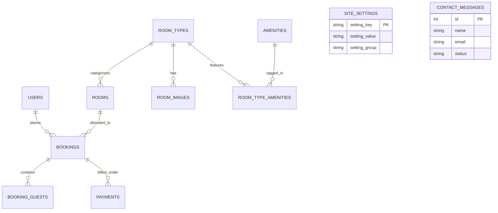

# ADISHIV LUXURY HOTEL & SUITES — MASTER PROJECT SPECIFICATION
**Location:** Diplomatic Enclave, Chanakyapuri, New Delhi, India  
**Classification:** Ultra-Luxury Heritage Modern Boutique Hotel  
**Primary Currency:** INR (₹) | **Language:** English  
**Document Status:** Architecture & Specification Approved Candidate  
**Last Updated:** September 28, 2026  

---

## 1. PROJECT OBJECTIVE

The objective of this project is to architect, design, and build a world-class, production-ready web application for **Adishiv Hotel & Suites**, an ultra-luxury hospitality destination situated in the imperial heart of New Delhi, India.

Rather than looking like a generic template, Bootstrap admin, or cookie-cutter SaaS page, **Adishiv** will embody an **editorial, cinematic, and deeply intentional hospitality experience**. The platform unites:
1. An **Awwwards-caliber public frontend** with custom brand preloader, editorial typography, GSAP-powered motion choreography, fluid booking UX, and responsive art direction.
2. A **robust, secure PHP + MySQL backend** built on clean object-oriented architectural principles (without bulky framework overhead), delivering real date-range availability calculations, atomic booking reservations, guest authentication, and an intuitive administrative control dashboard.
3. A **decoupled configuration layer** allowing hotel management to modify room details, pricing, seasonal rates, amenities, photography, branding copy, and contact metadata dynamically without touching source code.

---

## 2. DESIGN DIRECTION & VISUAL IDENTITY

### 2.1 Aesthetic Concept: *"Sanctuary in the Imperial Capital"*
New Delhi is a city of historic imperial grandeur—from Mughal red sandstone arches and delicate geometric *jaali* screens to the classical geometry of Lutyens' Delhi and tranquil courtyard water bodies. 

Adishiv distills these timeless architectural elements into a **contemporary, quiet-luxury digital presence**:
- **Atmosphere:** Calm, regal, luminous, architectural, deeply hospitable.
- **Visual Balance:** Expansive negative space, razor-sharp editorial typography, high-contrast imagery, delicate metallic brass accents, and subtle glassmorphic surfaces.
- **Anti-Slop Guarantee:** Zero generic floating cards, zero random purple SaaS gradients, zero unmotivated animations. Every element has an architectural justification.

### 2.2 Color System
| Role | Color Name | Hex Code | Purpose / Usage |
| :--- | :--- | :--- | :--- |
| **Canvas Dark** | Imperial Obsidian | `#0C0F12` | Deep rich background for preloader, footer, and midnight hero accents |
| **Canvas Light** | Sandstone Silk | `#FBF9F5` | Primary editorial page background for daylight readability and warmth |
| **Surface Off-Light** | Delhi Parchment | `#F3EFE6` | Room cards, subtle section alternating backgrounds, form field wells |
| **Primary Brand Gold** | Aged Imperial Brass | `#C8A46B` | Primary CTAs, active indicators, borders, decorative hairline accents |
| **Luminous Gold** | Champagne Brass | `#DFBE85` | Hover states, button glow, focus rings, illuminated highlights |
| **Heritage Accent** | Sandstone Terracotta | `#944C3A` | Subtle editorial taglines, badge accents, warm historical grounding |
| **Heritage Garden** | Mughal Cypress | `#182A22` | Deep forest green for luxury wellness/spa highlights |
| **Text Primary (Dark)** | Midnight Charcoal | `#14171A` | Main typography on light backgrounds (WCAG AAA compliant: 14.8:1) |
| **Text Secondary** | Muted Slate | `#5C6470` | Secondary metadata, room specs, captions, timestamps |
| **Border Subtle** | Antique Hairline | `rgba(200, 164, 107, 0.22)` | Subtle luxury dividers, card borders, table separators |

### 2.3 Typography Hierarchy
- **Display Serif:** `Cormorant Garamond` (Google Font: weights 400, 500, 600, 700 + italic) — Used for H1/H2 headlines, room names, editorial quotes, and signature brand numbers.
- **Body & Interface Sans:** `Plus Jakarta Sans` / `Manrope` (weights 300, 400, 500, 600, 700) — High-legibility geometric sans-serif for body copy, booking controls, form labels, and microcopy.
- **Utility & Data:** `Cinzel` & tabular numerals for currency figures (`₹ 18,500`), dates, and reservation references (`ADI-2026-8942`).

### 2.4 Design Reference Breakdown & Synthesis
1. **Left Coast (Preloader & Entry Choreography):**
   - *Key takeaway:* Elegant vector path-drawing animation + smooth curtain transition directly into the hero.
   - *Adishiv application:* A bespoke Adishiv geometric monogram (`A` with Mughal arch motif) drawn via SVG `stroke-dasharray`, transitioning gracefully into the hotel facade view without sudden flashing or layout shifts.
2. **Haven Annecy (Hospitality Editorial Rhythm & Spacing):**
   - *Key takeaway:* Generous whitespace, asymmetric photo collages, subtle typography badges ("Brunch time", "Imperial Verandah"), calm pacing.
   - *Adishiv application:* Storytelling layout for dining, suites, and wellness experiences, treating photography like an art exhibition.
3. **Qissa (Contrast, Typography & Menu Experience):**
   - *Key takeaway:* Midnight background contrast, Cormorant Garamond pairings, fullscreen luxury overlay navigation with numbered items (`01 Sanctuary`, `02 Suites`, `03 Dining`).
   - *Adishiv application:* Fullscreen drawer navigation with high-end typography reveals, magnetic close button, and immediate booking CTA.

---

## 3. TECHNOLOGY CONSTRAINTS & STACK

| Layer | Selected Technologies | Architectural Justification |
| :--- | :--- | :--- |
| **Frontend Core** | HTML5 Semantic, Modern CSS3 (Vanilla), Vanilla ES6+ JavaScript | Zero build-step dependencies, blistering fast TTFB, maximum maintainability and longevity. |
| **Animation Engine** | GSAP 3.12+ (Timeline, ScrollTrigger, CustomEase) | Unrivaled 60fps performance, hardware acceleration, precise timeline orchestration. |
| **Backend Core** | PHP 8.0+ (Vanilla Object-Oriented MVC/Service Pattern) | Native support across standard XAMPP/Apache/Nginx environments, lightweight and robust. |
| **Database** | MySQL 5.7+ / 8.0+ / MariaDB 10.4+ (InnoDB Engine) | ACID compliance, row-level locking for atomic booking reservations, relational integrity. |
| **Database Access** | PHP PDO with Prepared Statements | Complete immunity to SQL injection vulnerabilities; parameterized queries throughout. |
| **Security Suite** | CSRF Tokens, Secure HttpOnly/SameSite Sessions, `htmlspecialchars()` escaping, strict regex input validation | Enterprise-grade defensive architecture. |
| **Asset Delivery** | WebP/JPEG responsive images with `loading="lazy"`, SVG vectors for icons | Maximum visual fidelity with sub-100kb payload chunks. |

---

## 4. SITE ARCHITECTURE & ROUTING

```
c:\Users\Raj\Desktop\Hotel B&M System\
├── assets/
│   ├── css/
│   │   ├── variables.css           # Global design tokens, colors, type scales, elevations
│   │   ├── base.css                # Reset, resets, typography, global utilities
│   │   ├── components.css          # Buttons, cards, modals, navigation, inputs, notifications
│   │   ├── motion.css              # Preloader, transitions, cursor, keyframe animations
│   │   └── admin.css               # Admin dashboard specific layout and dense data styling
│   ├── js/
│   │   ├── core.js                 # App initialization, smooth scroll, reduced motion check
│   │   ├── preloader.js            # Cinematic intro sequence & timeline
│   │   ├── navigation.js           # Fullscreen menu, sticky header, scroll indicators
│   │   ├── booking-widget.js       # Real-time booking UX, datepicker, AJAX price calculation
│   │   └── animations.js           # ScrollTrigger reveals, parallax, magnetic buttons
│   ├── images/
│   │   ├── branding/               # Logos, hero facade, architectural photography
│   │   ├── rooms/                  # Deluxe Verandah, Imperial Suite, Presidential Residence
│   │   ├── dining/                 # Aura restaurant, Peacock Bar, private courtyard dining
│   │   └── wellness/               # Heated marble pool, Ayurvedic spa, gym
│   └── fonts/                      # Self-hosted / preloaded web fonts
├── config/
│   ├── database.php                # PDO connection singleton with connection pooling & error handling
│   ├── config.php                  # Environment loader, currency settings, app constants
│   └── mail.php                    # Transactional email configuration & drivers
├── includes/
│   ├── header.php                  # Global HTML head, meta tags, luxury navbar, preloader DOM
│   ├── footer.php                  # Global editorial footer, newsletter, legal, scripts
│   ├── auth.php                    # Session authorization guards, role verification
│   ├── functions.php               # Security helpers: csrf_token(), sanitize(), format_inr(), e()
│   └── booking-helper.php          # Date overlapping validation, room allocation, GST math
├── api/
│   ├── check-availability.php      # JSON endpoint: returns available room types for given date range
│   ├── calculate-pricing.php       # JSON endpoint: calculates nights, base rate, 18% GST, totals
│   ├── create-booking.php          # JSON endpoint: atomic booking transaction + reference generation
│   └── contact-submit.php          # JSON endpoint: contact enquiry handling
├── admin/
│   ├── index.php                   # Dashboard: revenue KPI, occupancy rate, today's check-ins/outs
│   ├── bookings.php                # Booking management: search, filter by status/date, cancel/check-in
│   ├── rooms.php                   # Room catalog: add/edit room types, pricing, physical room status
│   ├── customers.php               # Guest records, stay histories, contact details
│   ├── messages.php                # Contact inquiries inbox
│   ├── settings.php                # Dynamic hotel branding, phone, address, tax rate manager
│   ├── login.php                   # Admin secure authentication entry
│   └── logout.php                  # Session destruction & redirect
├── public/                         # Public-facing views
│   ├── index.php                   # Homepage (Hero, Booking bar, Suites, Dining, Story, Gallery)
│   ├── rooms.php                   # Complete rooms & suites catalog with filters
│   ├── room-details.php            # Deep editorial room showcase, amenities list, room booking CTA
│   ├── booking.php                 # Multi-step cinematic booking wizard
│   ├── confirmation.php            # High-conversion confirmation view with booking voucher & print
│   ├── dining.php                  # Aura restaurant & Peacock Bar culinary showcase
│   ├── experiences.php             # Courtyard pool, Ayurvedic spa, Delhi heritage tours
│   ├── gallery.php                 # Editorial interactive image gallery with lightbox
│   ├── about.php                   # The Adishiv heritage narrative & architectural ethos
│   ├── contact.php                 # Concierge inquiry form, location map, contact cards
│   ├── login.php                   # Guest login & account portal
│   └── register.php                # Guest registration
├── database/
│   └── schema.sql                  # Production MySQL schema, foreign keys, indexes, seeds
├── uploads/                        # Dynamic uploaded imagery (rooms, gallery)
├── .env.example                    # Environment template
├── README.md                       # Comprehensive deployment & operational documentation
└── PROJECT_TASK.md                 # Single source of truth (this document)
```

---

## 5. PAGE LIST & SECTION SPECIFICATIONS

### 5.1 Public Pages
1. **Homepage (`/index.php`):**
   - **Hero Section:** Full-viewport architectural hero, location badge (`28°36'N · New Delhi`), title *"Sanctuary in the Imperial Capital"*, subtle sound/pause control, integrated quick-booking bar.
   - **Integrated Booking Strip:** Inline check-in, check-out, guests count, room type selector, instant "Check Availability" CTA.
   - **Hotel Introduction (Editorial Prose):** Storytelling block contrasting Delhi's vibrant pulse with Adishiv's tranquil courtyard silence.
   - **Signature Suites Preview:** Staggered editorial cards with room images, square footage, bed configuration, nightly rate in ₹, and instant view buttons.
   - **The Courtyard & Pool Experience:** Full-width photographic section with subtle parallax.
   - **Culinary Art (Aura Restaurant & Peacock Bar):** Menus teaser, chef philosophy, private dining booking.
   - **Wellness & Spa:** Ayurvedic therapies, thermal baths, private morning yoga.
   - **Interactive Editorial Gallery:** Curated photographs of architecture, interiors, and gastronomy.
   - **Guest Testimonials / Press Accolades:** Quotes from luxury travel publications.
   - **Editorial Footer:** Address in Diplomatic Enclave, direct concierge phone, newsletter, navigation links, copyright.

2. **Rooms & Suites (`/rooms.php`):**
   - Categorized listing (Deluxe Verandah, Imperial Suite, Presidential Residence).
   - Filter by guest capacity and price tier.
   - Rich specifications: dimensions, bed types, garden/courtyard views, luxury perks.

3. **Room Details (`/room-details.php?slug=...`):**
   - Dynamic view populated from MySQL.
   - High-resolution multi-angle photography carousel.
   - Floor plan overview, dedicated amenities checklist, inclusive services (butler, breakfast).
   - Sticky booking summary card with live pricing calculation.

4. **Booking Experience (`/booking.php`):**
   - 4-Step cinematic progression:
     1. *Dates & Guests Selection*
     2. *Room Selection (with real-time availability badges)*
     3. *Guest Identification & Special Requests*
     4. *Review, GST Calculation & Confirmation*
   - Asynchronous step transitions without page flickers.

5. **Booking Confirmation (`/confirmation.php?ref=ADI-XXXX`):**
   - Luxury voucher layout with booking reference, QR verification placeholder, printable guest pass, itinerary breakdown, cancellation policy, direct concierge assistance contact.

6. **Dining (`/dining.php`):**
   - Aura Fine Dining: Modern Indian gastronomy, degustation menu highlights.
   - The Peacock Library Bar: Single malts, botanical cocktail lounge.
   - In-Suite Dining: 24-hour curated menu.

7. **Experiences & Wellness (`/experiences.php`):**
   - Ayurvedic wellness, heated courtyard lap pool, private city heritage excursions.

8. **Gallery (`/gallery.php`):**
   - Editorial masonry layout with filter tabs (Architecture, Suites, Gastronomy, Courtyard). Fullscreen high-res lightbox modal.

9. **The Heritage / About (`/about.php`):**
   - Architectural narrative, sustainable luxury initiatives, leadership team.

10. **Contact & Concierge (`/contact.php`):**
    - Direct phone numbers for Concierge, Reservations, and Events.
    - Interactive AJAX inquiry form with instant validation.
    - Location guide from Indira Gandhi International Airport (DEL).

11. **Guest Authentication (`/login.php`, `/register.php`):**
    - Clean guest portal to view upcoming reservations, past stays, and profile preferences.

---

## 6. PRELOADER & CINEMATIC MOTION SYSTEM

### 6.1 The Preloader Sequence (Left Coast Reference Inspired)
The preloader is an essential hallmark of luxury web craft:
1. **Curtain State:** Fullscreen obsidian canvas (`#0C0F12`), preventing any FOUC (flash of unstyled content).
2. **Phase 1 — Monogram Emergence (0.0s – 0.9s):** An SVG imperial arch and "A" monogram path animates via `stroke-dashoffset` from 1 to 0 in antique brass gold (`#C8A46B`).
3. **Phase 2 — Brand Typography & Progress (0.9s – 1.8s):**
   - Staggered letter reveal: "A D I S H I V" in Cormorant Garamond.
   - Sub-label: *"New Delhi · Sanctuary in the Imperial Capital"*.
   - Minimalist hairline progress bar fills smoothly from 0% to 100%.
4. **Phase 3 — The Unveiling Curtain (1.8s – 2.6s):**
   - The dark canvas splits or wipes vertically via `clip-path: polygon(0 0, 100% 0, 100% 0, 0 0)` to reveal the illuminated dusk facade hero image.
   - The hero title and booking strip glide upward into resting position with smooth cubic-bezier easing (`power3.out`).
5. **Session Memory:** If a user navigates between pages during the same session, a compact 0.4s micro-transition is used instead of replaying the full 2.6s intro.

### 6.2 Motion Design Philosophy
- **Restraint Over Clutter:** Movement serves only to communicate hierarchy, spatial depth, and state transitions.
- **ScrollTrigger Orchestration:** Section headings subtly slide up with opacity fades; room photos reveal with subtle image clipping masks (`clip-path: inset(10% 0 10% 0)` expanding to full size).
- **Magnetic Micro-Interactions:** Primary gold buttons follow cursor proximity slightly on desktop (8px max pull), snapping back with elastic ease.
- **Hardware Acceleration:** All animations strictly operate on `transform` and `opacity` properties to ensure 60fps rendering without CPU repaints.
- **Accessibility Safeguard:** Respects `@media (prefers-reduced-motion: reduce)` by immediately removing transitions and presenting the final visual state.

---

## 7. BOOKING SYSTEM & BUSINESS LOGIC

### 7.1 Booking UX Flow
```
[ Step 1: Search ]
  Check-in Date + Check-out Date + Guests Count + Room Category
       │
       ▼ (AJAX call to /api/check-availability.php)
[ Step 2: Available Suites ]
  Displays real-time inventory matching capacity and date window
  Instant night count & pricing calculation
       │
       ▼ (User clicks "Select Suite")
[ Step 3: Guest Information & Preferences ]
  Name, Email, Mobile (Indian/International format), ID Proof type, Special requests
       │
       ▼ (Client-side validation + CSRF verification)
[ Step 4: Review & Reservation ]
  Breakdown: Room subtotal + 18% GST (Goods & Services Tax) = Total INR (₹)
  Payment Option: "Pay at Hotel upon Arrival / Counter" or "Secure Guarantee"
       │
       ▼ (Atomic POST to /api/create-booking.php with DB transaction)
[ Step 5: Booking Confirmation ]
  Generation of unique voucher reference: ADI-2026-XXXX
  Instant confirmation view + option to Print/Download pass
```

### 7.2 Strict Date Validation Rules
- Check-out date must strictly be at least 1 day after check-in date.
- Check-in cannot be set in the past (before today's local date `Asia/Kolkata`).
- Maximum advance booking window: 365 days.
- Maximum guest count cannot exceed the selected room type's `max_guests`.

### 7.3 Double-Booking Prevention Algorithm
To prevent race conditions and overlapping double-bookings:
```sql
-- Check if room has any active booking overlapping with requested dates:
SELECT COUNT(*) FROM bookings 
WHERE room_id = :room_id 
  AND status IN ('confirmed', 'checked_in')
  AND NOT (check_out <= :new_check_in OR check_in >= :new_check_out);
```
During creation, bookings execute inside an InnoDB transaction with `FOR UPDATE` row-level locks on the physical room table, ensuring 100% collision-free reservations even during simultaneous booking attempts.

---

## 8. DATABASE SCHEMA (NORMALIZED MYSQL)

The database schema is fully defined in [`database/schema.sql`](file:///c:/Users/Raj/Desktop/Hotel%20B&M%20System/database/schema.sql) with 11 relational tables:



1. **`users`:** Staff (Admin, Concierge, Frontdesk) and registered guest accounts with bcrypt hashes.
2. **`room_types`:** Suite categories, base pricing in INR, maximum guest limit, bed types, dimensions, description.
3. **`rooms`:** Physical room numbers (101, 102, 201...) linked to room types with live status (`available`, `occupied`, `maintenance`).
4. **`room_images`:** Multi-image gallery per room type with sort orders and primary flags.
5. **`amenities`:** Catalog of hotel & suite amenities with icons and categories.
6. **`room_type_amenities`:** Pivot table linking room types to amenities.
7. **`bookings`:** Master booking records with unique references (`ADI-2026-XXXX`), dates, guest totals, and GST calculation.
8. **`booking_guests`:** Details of primary and additional guests staying under the reservation.
9. **`payments`:** Financial ledger supporting `pay_at_hotel`, UPI, and card payments.
10. **`contact_messages`:** Guest inquiries, event requests, and status flags.
11. **`site_settings`:** Key-value table for hotel phone, email, address, and seasonal rates.

---

## 9. ADMINISTRATIVE CONTROL PANEL

The Admin Dashboard (`/admin/`) provides a clean, information-dense management workspace designed for rapid daily operations without decorative clutter.

### 9.1 Core Administrative Capabilities
- **Overview Dashboard:**
  - Real-time KPIs: Today's Check-ins, Today's Check-outs, Current Occupancy Rate (%), Total Revenue for Current Month (₹), Pending Inquiries.
  - Quick action to create manual walk-in reservations.
  - Active booking table with instant search and status filters (`Confirmed`, `Checked-in`, `Checked-out`, `Cancelled`).
- **Room & Inventory Management:**
  - View physical room grid with instant status toggle (`Available` ↔ `Maintenance` ↔ `Housekeeping`).
  - Edit room type prices (adjust nightly rate for peak tourist seasons).
  - Add or update suite photographs and descriptions.
- **Booking Management:**
  - View guest contact details, stay dates, guest count, and billing breakdown.
  - Perform Check-in and Check-out state transitions.
  - Process cancellations with logged reasons.
- **Guest Inquiries / Concierge Inbox:**
  - Read incoming messages from the contact form.
  - Mark messages as `Read`, `Replied`, or `Archived`.
- **Hotel Settings Management:**
  - Update hotel contact phone numbers, concierge email, physical address, and GST percentage dynamically.

---

## 10. SECURITY & DEFENSIVE ARCHITECTURE

1. **SQL Injection Defense:** Zero raw query concatenation. 100% of queries use PDO prepared statements with strict parameter type binding.
2. **Cross-Site Scripting (XSS) Defense:** All user and dynamic database strings rendered into HTML pass through an explicit `e($string)` helper utilizing `htmlspecialchars($string, ENT_QUOTES | ENT_SUBSTITUTE, 'UTF-8')`.
3. **Cross-Site Request Forgery (CSRF) Defense:** All state-changing POST/PUT requests require a valid cryptographic CSRF token stored in the user's session and verified on the server before processing.
4. **Password Security:** All passwords stored using `password_hash($password, PASSWORD_BCRYPT, ['cost' => 12])` and validated via `password_verify()`.
5. **Session Hardening:** 
   - Cookie flags: `HttpOnly`, `SameSite=Lax`, and `Secure` (when SSL is active).
   - Session ID regeneration (`session_regenerate_id(true)`) upon authentication state changes to prevent session fixation.
6. **File Upload Safety:** Dedicated MIME-type sniffing, extension whitelisting (`jpg`, `jpeg`, `png`, `webp`), file size limits (max 5MB), and renaming using cryptographic hashes.

---

## 11. ACCESSIBILITY, RESPONSIVENESS & PERFORMANCE

### 11.1 Accessibility (WCAG 2.2 AA Standard)
- Semantic HTML5 structure (`<header>`, `<main>`, `<nav>`, `<section>`, `<article>`, `<footer>`).
- Contrast ratio exceeding 4.5:1 for standard text and 3:1 for large display headlines.
- Full keyboard navigation support with visible focus indicators (`:focus-visible`).
- Screen reader ARIA attributes on modals (`aria-modal="true"`, `role="dialog"`), navigation triggers (`aria-expanded`, `aria-controls`), and booking alerts (`role="status"`, `aria-live="polite"`).
- Respect for `prefers-reduced-motion: reduce`.

### 11.2 Responsive Layout Art Direction
- **Desktop (1440px+):** Grand editorial multi-column layouts, magnetic buttons, custom cursor micro-feedback.
- **Laptop / Tablet (768px – 1366px):** Proportional fluid grids, touch-friendly touch targets (min 44×44px).
- **Mobile (320px – 767px):** Single-column streamlined layout, full-bleed mobile booking drawer, custom cursor disabled, zero horizontal overflow.

### 11.3 Performance Optimizations
- Lightweight vanilla codebase: Total JavaScript footprint < 90KB (excluding external GSAP CDN).
- Native image lazy-loading (`loading="lazy"`), explicit `width` and `height` attributes to eliminate cumulative layout shifts (CLS).
- Modern font preloading (`font-display: swap`).

---

## 12. DEVELOPMENT PHASES & MILESTONES

- [x] **Phase 1: Research, Workspace Inspection & Architecture (Completed)**
  - Inspected workspace and available skill ecosystem.
  - Analyzed design references (Left Coast, Haven Annecy, Qissa).
  - Drafted comprehensive MySQL database schema (`database/schema.sql`).
  - Created decoupled environment config (`.env.example`).
  - Generated original visual direction assets for Adishiv Hotel facade and Presidential suite.
  - Created master project specification (`PROJECT_TASK.md`).
- [ ] **Phase 2: Design System & Core Frontend Foundation**
  - Implement `assets/css/variables.css`, `base.css`, and `components.css`.
  - Build header navigation, full-screen luxury drawer, and global footer.
- [ ] **Phase 3: Motion Choreography & Preloader**
  - Build bespoke Adishiv SVG monogram preloader with Left Coast-inspired curtain reveal.
  - Implement GSAP ScrollTrigger timeline reveals for homepage sections.
- [ ] **Phase 4: Backend Architecture & Database Integration**
  - Implement PDO database wrapper, configuration loader, and security helpers.
  - Create database migration/seeding script for one-click setup.
  - Build authentication subsystem (login, register, session guards).
- [ ] **Phase 5: Booking Subsystem & API Endpoints**
  - Build `/api/check-availability.php`, `/api/calculate-pricing.php`, and `/api/create-booking.php`.
  - Implement multi-step booking wizard with live calculations and voucher generation.
- [ ] **Phase 6: Room Catalog & Editorial Content Pages**
  - Build `rooms.php`, `room-details.php`, `dining.php`, `experiences.php`, `gallery.php`, and `about.php`.
  - Connect dynamic data querying to MySQL with fallback data handling.
- [ ] **Phase 7: Administrative Control Panel**
  - Build `/admin/index.php` (KPIs, occupancy, check-in queue).
  - Implement room status manager, booking manager, and guest inquiry viewer.
- [ ] **Phase 8: Comprehensive QA, Accessibility & Verification**
  - Test booking flow, duplicate booking prevention, and input validation.
  - Run browser visual checks across desktop, tablet, and mobile breakpoints.
  - Generate complete `README.md` with setup instructions.

---

## 13. TESTING CHECKLIST & DEFINITION OF DONE

### Verification Criteria Before Final Handoff
1. **Visual & Motion Quality:**
   - Preloader animates cleanly without stutter or white flashes.
   - Layout transitions smoothly on load; typography renders crisply with zero layout shift.
   - Mobile navigation operates smoothly with zero horizontal scrollbar.
2. **Booking Engine Integrity:**
   - Real-time date availability matches database state.
   - Overlapping bookings on the same physical room are strictly blocked.
   - Correct 18% GST calculation and INR currency formatting (`₹`).
   - Generates unique reference code (`ADI-2026-XXXX`) upon confirmation.
3. **Admin Functionality:**
   - Admin login securely authenticates with hashed password.
   - Status changes (Confirmed → Checked-in → Checked-out) immediately reflect in database.
   - Admin dashboard displays accurate occupancy and booking counts.
4. **Security Audit:**
   - SQL injection attempts blocked via prepared statements.
   - XSS payloads neutralized via output encoding.
   - CSRF tokens validated on all submissions.
   - Passwords securely hashed with bcrypt.
5. **Code & Documentation:**
   - Clean, commented, maintainable codebase without dead code.
   - Complete `README.md` with step-by-step local testing guide.
